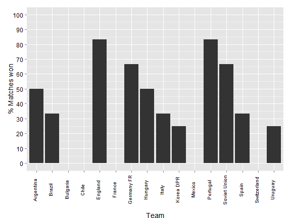
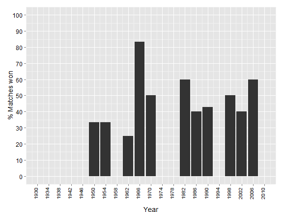

## Slide 2: Background

1. Aim: To produce a simple R Shiny application
2. Concept: An application that displays the percentage of matches won in the Football World Cup
3. Detail: The data will be displayed as:
        a) A plot of percentage wins by all countries within a tournament; or 
        b) A plot of percentage winds by a single country across all years
4. Data downloaded from: 
        http://www.theguardian.com/news/datablog/2010/may/05/world-cup-historical-statistics

--- .class #id 

## Slide 3: Example plot of each countries' performance within a tournament (e.g. 1966)

 

--- .class #id 

## Slide 4: Example plot of a single country (e.g. England) over all the year of the World Cup (data: 1930 - 2006)

 

--- &interactive

## Slide 5: Example calculation of percentage of matches won

<textarea class='interactive' id='interactive{{slide.num}}' data-cell='{{slide.num}}' data-results='asis' style='display:none'>matches_won<-5
matches_drawn<- 2
matches_lost <- 2
matches_played <- matches_won+matches_drawn+matches_lost
percentage_wins <- as.integer((matches_won/matches_played)*100)
result <-paste("Percentage of matches won = " , percentage_wins)
result</textarea>

--- &interactive
## Results = Markup

<textarea class='interactive' id='interactive{{slide.num}}' data-cell='{{slide.num}}' data-results='asis' style='display:none'>x <-11+12
x</textarea>

